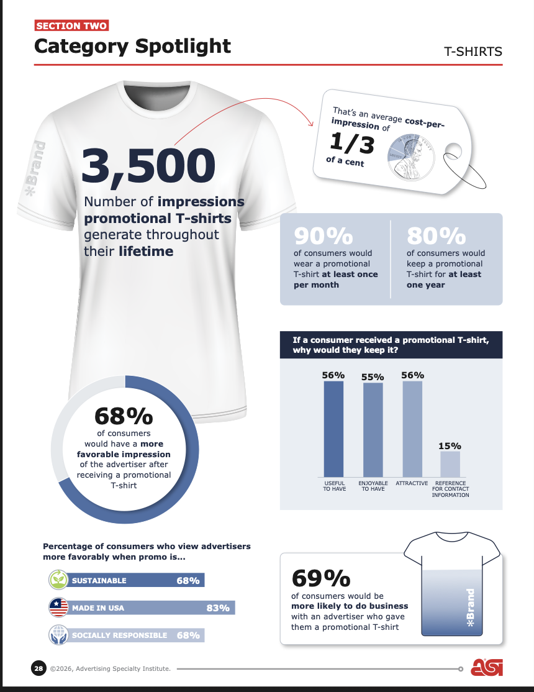

# Intro

::::: {layout-ncol="2"}
::: {#first-column}
My story is examining the environmental impact of different materials used to make T-shirts — one of the most common promotional products distributed in the United States. The environmental impact is measured by carbon footprint and water usage, and the materials I’ll be looking at are five different types of cotton blends. To put the environmental impact into context, I’ll work in data from [Advertising Specialty Institute’s 2026 end-user survey](https://media.asicentral.com/resources/AdImpressionStudy/Ad-Impressions-2026.pdf) about impressions and longevity, and the company’s calculation of impressions over lifespan for T-shirts (3,500). <br> <br>

The pitch has been discussed with my editors at Advertising Specialty Institute and largely green-lit. The company’s audience is the promotional products industry, so the intention with this story is to give readers more information on the types of T-shirts they’re buying. There are lots of factors to consider — price, quality, etc — but more organized information about the different materials used to make T-shirts and its respective environmental impact might be helpful for potential buyers to consider. <br> <br> :::
:::

::: {#second-column}

:::
:::::

# End-User Survey Data

Every year, Advertising Specialty Institute releases survey data showing the impact the promotional products industry has. The findings come from online surveys of consumers, who respond to various questions stratified by product type. The dataset has specific insight into how consumers interact with T-shirts, including the potential reach the product might have and how long consumers tend to keep it. The impressions and longevity data was used by the newsroom to estimate impressions per lifetime for T-shirts.

### Impressions

In this section of the survey, respondents were asked on average, how many people see them when they wear a promotional T-shirt. There are no clear trends in the responses, but over three fourths of the respondents say more than six people see the shirt when they wear it.

<iframe title="Impressions: How many people see you wear the T-shirt?" aria-label="Bar Chart" id="datawrapper-chart-AGdOx" src="https://datawrapper.dwcdn.net/AGdOx/1/" scrolling="no" frameborder="0" style="width: 0; min-width: 100% !important; border: none;" height data-external="1">

</iframe>

```{=html}
<script type="text/javascript">(function(){function e(){window.addEventListener(`message`,function(e){if(e.data[`datawrapper-height`]!==void 0){var t=document.querySelectorAll(`iframe`);for(var n in e.data[`datawrapper-height`])for(var r=0,i;i=t[r];r++)if(i.contentWindow===e.source){var a=e.data[`datawrapper-height`][n]+`px`;i.style.height=a}}})}e()})();</script>
```

### Longevity

Respondents were asked how long they tend to keep their T-shirts. Over a third of respondents say they would keep it for over five years, and 80% say they would keep it for a year or longer. <br>

(Note: there's not survey question on what consumers tend to do with T-shirts when they dispose of them, which could have been helpful in the context of recycled cotton.) <br>

<iframe title="Longevity: how long would you keep the T-shirt?" aria-label="Bar Chart" id="datawrapper-chart-RSIs0" src="https://datawrapper.dwcdn.net/RSIs0/1/" scrolling="no" frameborder="0" style="width: 0; min-width: 100% !important; border: none;" height data-external="1">

</iframe>

```{=html}
<script type="text/javascript">(function(){function e(){window.addEventListener(`message`,function(e){if(e.data[`datawrapper-height`]!==void 0){var t=document.querySelectorAll(`iframe`);for(var n in e.data[`datawrapper-height`])for(var r=0,i;i=t[r];r++)if(i.contentWindow===e.source){var a=e.data[`datawrapper-height`][n]+`px`;i.style.height=a}}})}e()})();</script>
```

# Pursuit of environmental impact data <br>

### Textile Exchange: Cotton Life Cycle Assessment

Another resource that was provided by the newsroom is a Life Cycle Assessment for cotton produced by [Textile Exchange](https://textileexchange.org/knowledge-center/reports/cotton-life-cycle-assessment/), a nonprofit that conducts research on sustainability in the supply chain. This was helpful because it provided a thorough overview of the different steps in the supply chain for cotton production and compares different countries. The assessment found that climate change impacts are primarily driven by field emissions of nitrous oxide, resulting from nitrogen fertilizer application. It didn't use water use or carbon emissions to measure environmental impact or stratify by different types of cotton. Although, the assessment did briefly touch on water usage, to note that impacts are almost entirely determined by irrigation water.

### Cotton Incorporated: Cotton Life Cycle Assessment 
Cotton Incorporated is nonprofit research organization founded by cotton growers and importers. In 2019, the company released its own [life cycle assessment for cotton](https://cottontoday.cottoninc.com/wp-content/uploads/2019/11/2016-LCA-Full-Report-Update.pdf), including how much water cotton uses from cradle to gate. Cradle to gate stops tracking consumption when the product reaches the manufacturer - before a T-shirt would have any impressions. Cradle to grave metrics may include water usage in the form of washing a T-shirt over its lifespan and would be better for this project. Nearly 82% of the water used in cotton production is used for irrigation. The report also notes that 2,235 cubic meters of blue water is used to produce 1,000 kg of cotton fiber. <br> 

That converts to 590,424 gallons of water per 1,000 kg of cotton fiber. According to the California Cotton Ginners and Growers Association, a T-shirt contains 0.22 kg of cotton fiber on average, so per T-shirt, about 129.8 gallons of water are used.  

This can give us an approximate of water usage per impression for T-shirts, though with the major caveat the water usage data is only cradle to gate. 


### End-user survey again: consumers

One of the other questions respondents addressed was how a promotional T-shirt being made sustainably would change their opinion of the company it's from. Nearly 70% of consumers would have at least some degree of a more positive opinion of the company, but it's important to note that the T-shirt given to them would be free either way, so it's at no personal cost to the consumer to source sustainably.

<iframe title="How would your opinion of the company change if you received a sustainably made T-shirt?" aria-label="Bar Chart" id="datawrapper-chart-jY3k1" src="https://datawrapper.dwcdn.net/jY3k1/1/" scrolling="no" frameborder="0" style="width: 0; min-width: 100% !important; border: none;" height data-external="1">

</iframe>

```{=html}
<script type="text/javascript">(function(){function e(){window.addEventListener(`message`,function(e){if(e.data[`datawrapper-height`]!==void 0){var t=document.querySelectorAll(`iframe`);for(var n in e.data[`datawrapper-height`])for(var r=0,i;i=t[r];r++)if(i.contentWindow===e.source){var a=e.data[`datawrapper-height`][n]+`px`;i.style.height=a}}})}e()})();</script>
```

### Independent calculators of environmental impact

#### Bonsai

[Bonsai](https://www.bonsai.uno/?mode=product&metric=GWP100&version=v2.1.6&product=C_Cotton&region=US&advanced=1&unit=kg) is a company that produces sustainability information about products. They have data from cotton lint, ginned, which produces -2.897 kg of carbon dioxide per 1 kg produced. This is interesting information because it indicates that at least one step of cotton production can potentially have a positive impact on the environment by removing carbon emissions, but since it’s for cotton overall and not stratified by cotton type, it’s not necessarily something I can use. It’s also using data from 2016, which is not ideal.

#### OEKO-TEX Impact Calculator

[The OKEO-TEX Impact Calculator](https://www.hohenstein.us/en-us/oeko-tex/impact-calculator) is a resource produced by Hohenstein, a German company that provides independent research on textile production. Its calculator provides the water and carbon output for the overall process of T-shirt production, but it's unclear if the products can be sorted by material. The current limitation is that it requires a license to use, and I don’t have the license.

### Company Calculators

Sustainable t-shirt companies often have calculators on their websites to show the positive environmental impact their product can have. That data is unusable because it can't be extrapolated to an entire product's supply chain, plus the newsroom doesn't want to promote to one business over another.

#### Everywhere Apparel

[Everywhere Apparel](https://everywhereapparel.com/?srsltid=AfmBOoqQqCkUUqy0wPlDRxvOtm2CBkSuPWu1hO5FffgP5kT_ai9N-W5b) uses recycled cotton to produce T-shirts. That company has information that indicates that for every T-shirt they produce, it saves 1,123 gallons of water, about one fifth of a pound of atmospheric carbon emissions and reduces landfill waste by 0.6 pounds, compared to a regular T-shirt. This is helpful because it indicates the unit of measurement that I could be looking for (gallons for water, pounds for atmospheric carbon emissions). <br>

#### Allmade

[Allmade](https://allmade.com/pages/impact) is a company that produces T-shirts with less impact on the environment. They calculate the carbon emissions generated during the life cycle and use a third party company (ClimeCO) to offset that carbon, and they say they use less water than a conventially produced T-shirt. In the company's calculator, they do separate the environmental impact per product based on cotton type, so I can findC example data for organic cotton and tri-blend. For recycled cotton, they only have heavyweight T-shirt examples, and I’m not sure if that can be used for this.

### Business spotlight 

Only one the top 10 companies listed on Advertising Specialty Institute's [Top Distributors ranking](https://members.asicentral.com/news/strategy/july-2025/counselor-top-40-distributors-2025/%5D) is publicly traded in the United States. The ninth-largest company in terms of revenue is BAMKO, which is owned by the publicly-traded Superior Group of Companies and based in Los Angeles, California. The conglomerate owns multiple companies, and its annual report, or Form 10-K, showed revenue is aggregated a little bit more closely and includes BAMKO in the "branded products" category. That category also includes High Performance Identity, a company that closely works with BAMKO to create custom uniforms for employers. Together, the division had nearly $90.9 billion in net sales in 2026, up 5.1% from 2025, per the SEC form. According to [Advertising Specialty Institute](https://members.asicentral.com/news/awards/july-2025/counselor-top-40-distributors-2025-no-9-bamko), BAMKO itself had a 3% sales increase from 2023 to 2025.

# What if?

#### \[During this week, I was unable to find data breaking down the carbon footprint and water usage of T-shirts based on the material. But here's what I'd do if I did!\] 
Notes:
Only 2.8% of cotton production in the United States is organic, per Cotton Incorporated. 


| Type | Conventional Blend | Organic Blend | Recycled Blend | 50/50 <br> Blend | Tri-Blend |
|------------|:----------:|:----------:|:----------:|:----------:|:----------:|
| Carbon Footprint |  |  |  |  |  |
| Water Usage |  |  |  |  |  |
| Impressions | 3500 | 3500 | 3500 | 3500 | 3500 |
| Carbon footprint per impression |  |  |  |  |  |
| Water usage per impression |  |  |  |  |  |

```{r}
#| include: false
library(tidyverse)
library(readxl)
library(googlesheets4)
library(googledrive)
library(janitor)
```

```{r}
#| include: false
asi_data_needed <- rio::import("https://docs.google.com/spreadsheets/d/1HyKYvl8NUcbQiNJRf6-M9yBzVGHWB8zAVFOjiHMVTeI/edit?gid=0#gid=0") 
```

```{r}
#| include: false
asi_data_needed <- rio::import("https://docs.google.com/spreadsheets/d/1HyKYvl8NUcbQiNJRf6-M9yBzVGHWB8zAVFOjiHMVTeI/edit?gid=0#gid=0") 
```

```{r}
#| include: false
asi_data_needed
```

```{r}
#| include: false
us_ads <- rio::import("https://github.com/djnf-data-2026/emily-wilson/raw/refs/heads/main/data/2026%20Ad%20Impressions%20US%20Products.xlsx")
```

```{r}
#| include: false
impressions <- us_ads[95:108, ]

colnames(impressions) <- impressions[1, ]

impressions <- impressions |>
  clean_names() |>
  as_tibble()

impressions <- impressions[-1, ] |>
  mutate(across(2:21, as.numeric)) |>
  rename(item = na)

impressions |> 
  select(1:21) |> 
  head()
```

```{r}
#| include: false
tshirt_impressions <- impressions %>% select("item", "t_shirts")

tshirt_impressions
```

```{r}
#| include: false
longevity <- us_ads[118:131, ]

colnames(longevity) <- longevity[1, ]

longevity <- longevity |>
  clean_names() |>
  as_tibble()

longevity <- longevity[-1, ] |>
  mutate(across(2:21, as.numeric)) |>
  rename(item = na)
```

```{r}
#| include: false
tshirt_longevity <- longevity %>% select("item", "t_shirts")
```

```{r}
#| include: false
tshirt_longevity
```
